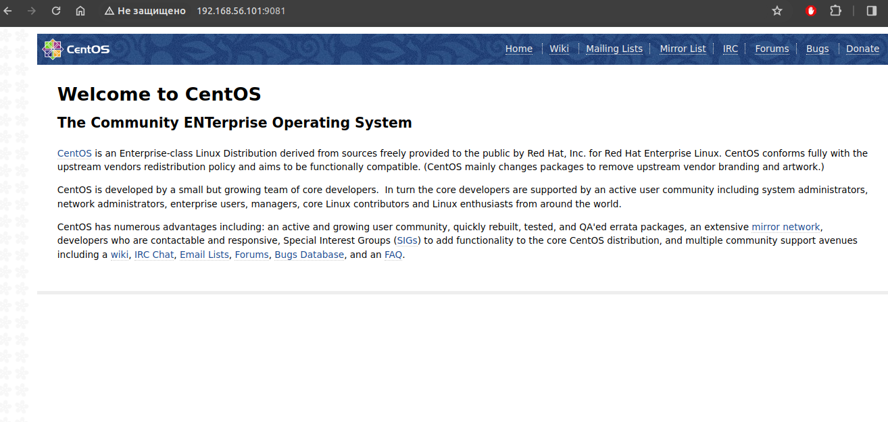

# lab - 12

## Задача:

### 1. Запустить nginx на нестандартном порту 3-мя разными способами:

* переключатели setsebool;
* добавление нестандартного порта в имеющийся тип;
* формирование и установка модуля SELinux.
К сдаче:
README с описанием каждого решения (скриншоты и демонстрация приветствуются).

### 2. Обеспечить работоспособность приложения при включенном selinux.

Развернуть приложенный [стенд](https://github.com/mbfx/otus-linux-adm/tree/master/selinux_dns_problems);
выяснить причину неработоспособности механизма обновления зоны (см. README);
предложить решение (или решения) для данной проблемы;
выбрать одно из решений для реализации, предварительно обосновав выбор;
реализовать выбранное решение и продемонстрировать его работоспособность.

К сдаче:
README с анализом причины неработоспособности, возможными способами решения и обоснованием выбора одного из них;
исправленный стенд или демонстрация работоспособной системы скриншотами и описанием.

## Выполнение

### 1. Запустить nginx на нестандартном порту 3-мя разными способами.

Анализируем лок событий:
`audit2why < /var/log/audit/audit.log`

  * переключатели setsebool
    проверяем что nginx не отвечает:
    ```
    systemctl restart nginx
    systemctl status nginx
    curl http://127.0.0.1:9081
    ```
    включаем setsebool:
    ```
    setsebool -P nis_enabled 1
    systemctl restart nginx
    ```
    проверяем что nginx  отвечает:
    `curl http://127.0.0.1:9081`
    возвращаем все первоначальный вид:
    ```
    setsebool -P nis_enabled 0
    systemctl restart nginx
    ```
  * добавление нестандартного порта в имеющийся тип
    проверяем что nginx не отвечает:
    ```
    systemctl restart nginx
    systemctl status nginx
    curl http://127.0.0.1:9081
    ```
    добавляем нестандартный порт в имеющийся тип:
    ```
    sealert -a /var/log/audit/audit.log 
    semanage port -a -t http_port_t -p tcp 9081
    systemctl restart nginx
    ```
    проверяем что nginx  отвечает:
    `curl http://127.0.0.1:9081`
    возвращаем все первоначальный вид:
    ```
    semanage port -a -t http_port_t -p tcp 9081
    systemctl restart nginx
    ```
  * формирование и установка модуля SELinux
    проверяем что nginx не отвечает:
    ```
    systemctl restart nginx
    systemctl status nginx
    curl http://127.0.0.1:9081
    ```
    формирем и установаем модуль SELinux
    ```
    ausearch -c 'nginx' --raw | audit2allow -M my-nginx
    semodule -i my-nginx.pp
    systemctl restart nginx
    ```
    проверяем что nginx  отвечает:
    `curl http://127.0.0.1:9081`
    или через браузер

### 2. Обеспечить работоспособность приложения при включенном selinux.vg

на кинете пробуем обновить зону:
```
[vagrant@client ~]$ nsupdate -k /etc/named.zonetransfer.key
> server 192.168.50.10
> zone ddns.lab
> update add www.ddns.lab. 60 A 192.168.50.15
> send
update failed: SERVFAIL
> quit
```
на сервере проверяем логи:
```
root@ns01 ~]# cat /var/log/audit/audit.log | audit2why
type=AVC msg=audit(1710166558.672:1934): avc:  denied  { create } for  pid=5217 comm="isc-worker0000" name="named.ddns.lab.view1.jnl" scontext=system_u:system_r:named_t:s0 tcontext=system_u:object_r:etc_t:s0 tclass=file permissive=0

	Was caused by:
		Missing type enforcement (TE) allow rule.

		You can use audit2allow to generate a loadable module to allow this access.

type=AVC msg=audit(1710223597.264:2051): avc:  denied  { create } for  pid=5217 comm="isc-worker0000" name="named.ddns.lab.view1.jnl" scontext=system_u:system_r:named_t:s0 tcontext=system_u:object_r:etc_t:s0 tclass=file permissive=0

	Was caused by:
		Missing type enforcement (TE) allow rule.

		You can use audit2allow to generate a loadable module to allow this access.
```
Проверим каталог /etc/named:
```
[root@ns01 ~]# ls -laZ /etc/named
drw-rwx---. root named system_u:object_r:etc_t:s0       .
drwxr-xr-x. root root  system_u:object_r:etc_t:s0       ..
drw-rwx---. root named unconfined_u:object_r:etc_t:s0   dynamic
-rw-rw----. root named system_u:object_r:etc_t:s0       named.50.168.192.rev
-rw-rw----. root named system_u:object_r:etc_t:s0       named.dns.lab
-rw-rw----. root named system_u:object_r:etc_t:s0       named.dns.lab.view1
-rw-rw----. root named system_u:object_r:etc_t:s0       named.newdns.lab
```

Анализ логов и разрешний на директории с конфигами показвает что контекст безопасности не соответсвует требуемому для named.
Наилучшем решием будет установка необходимого конекста безопастности.

Меняем контекст безопастности:
`sudo chcon -R -t named_zone_t /etc/named`


Попробуем снова внести изменения с клиента: 
```
[vagrant@client ~]$ nsupdate -k /etc/named.zonetransfer.key
> server 192.168.50.10
> zone ddns.lab
> update add www.ddns.lab. 60 A 192.168.50.15
> send
> quit
```
Проверяем:
```
[vagrant@client ~]$ dig www.ddns.lab

; <<>> DiG 9.11.4-P2-RedHat-9.11.4-26.P2.el7_9.15 <<>> www.ddns.lab
;; global options: +cmd
;; Got answer:
;; ->>HEADER<<- opcode: QUERY, status: NOERROR, id: 53871
;; flags: qr aa rd ra; QUERY: 1, ANSWER: 1, AUTHORITY: 1, ADDITIONAL: 2

;; OPT PSEUDOSECTION:
; EDNS: version: 0, flags:; udp: 4096
;; QUESTION SECTION:
;www.ddns.lab.			IN	A

;; ANSWER SECTION:
www.ddns.lab.		60	IN	A	192.168.50.15

;; AUTHORITY SECTION:
ddns.lab.		3600	IN	NS	ns01.dns.lab.

;; ADDITIONAL SECTION:
ns01.dns.lab.		3600	IN	A	192.168.50.10

;; Query time: 0 msec
;; SERVER: 192.168.50.10#53(192.168.50.10)
;; WHEN: Tue Mar 12 08:09:47 UTC 2024
;; MSG SIZE  rcvd: 96
```
Исправленый стенд в папке 12/selinux_dns_problems