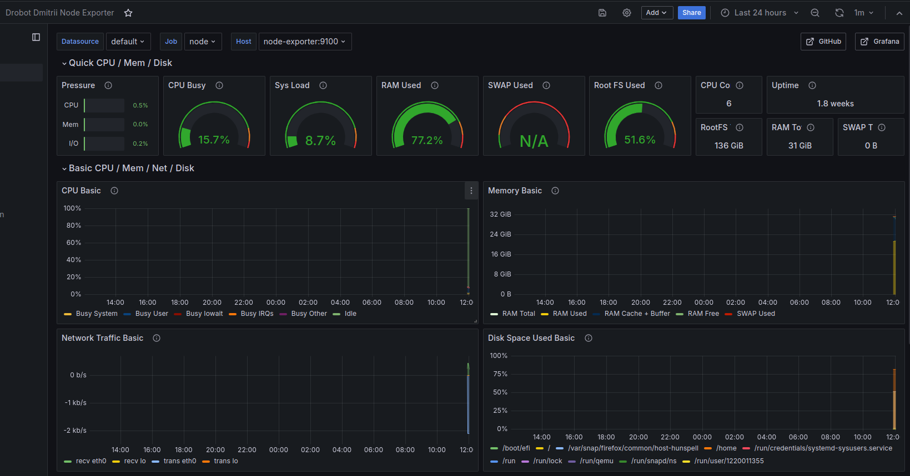

### Домашнее задание
Настройка мониторинга

#### Цель:
научиться настраивать дашборд;

##### Описание/Пошаговая инструкция выполнения домашнего задания:
Что нужно сделать?

Настроить дашборд с 4-мя графиками

- память;
- процессор;
- диск;
- сеть.
- Настроить на одной из систем:
- zabbix (использовать screen (комплексный экран);
- prometheus - grafana.

