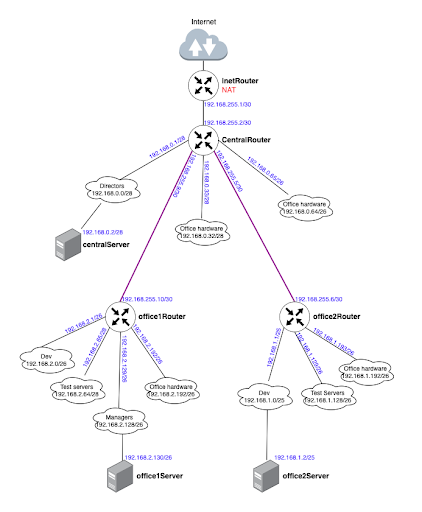

#### Цель домашнего задания
Научится менять базовые сетевые настройки в Linux-based системах.
#### Описание домашнего задания
1. Скачать и развернуть Vagrant-стенд https://github.com/erlong15/otus-linux/tree/network
2. Построить следующую сетевую архитектуру:
Сеть office1
- 192.168.2.0/26      - dev
- 192.168.2.64/26     - test servers
- 192.168.2.128/26    - managers
- 192.168.2.192/26    - office hardware

Сеть office2
- 192.168.1.0/25      - dev
- 192.168.1.128/26    - test servers
- 192.168.1.192/26    - office hardware

Сеть central
- 192.168.0.0/28     - directors
- 192.168.0.32/28    - office hardware
- 192.168.0.64/26    - wifi

Итого должны получиться следующие сервера:
inetRouter
centralRouter
office1Router
office2Router
centralServer
office1Server
office2Server

#### Задание состоит из 2-х частей: теоретической и практической.
В теоретической части требуется: 
* Найти свободные подсети
* Посчитать количество узлов в каждой подсети, включая свободные
* Указать Broadcast-адрес для каждой подсети
* Проверить, нет ли ошибок при разбиении

В практической части требуется: 
* Соединить офисы в сеть согласно логической схеме и настроить роутинг
* Интернет-трафик со всех серверов должен ходить через inetRouter
* Все сервера должны видеть друг друга (должен проходить ping)
* У всех новых серверов отключить дефолт на NAT (eth0), который vagrant поднимает для связи
* Добавить дополнительные сетевые интерфейсы, если потребуется

1. ##### Теоретическая часть
Для решение этой задачи написан скрипт netcalc.py.
Вывод скрипта:
```
    index        office          net_addr         net_name hosts        Hostmin        Hostmax      Broadcast
0       0  Сеть office1    192.168.2.0/26              dev    62    192.168.2.1   192.168.2.62   192.168.2.63
1       1  Сеть office1   192.168.2.64/26     test servers    62   192.168.2.65  192.168.2.126  192.168.2.127
2       2  Сеть office1  192.168.2.128/26         managers    62  192.168.2.129  192.168.2.190  192.168.2.191
3       3  Сеть office1  192.168.2.192/26  office hardware    62  192.168.2.193  192.168.2.254  192.168.2.255
4       4  Сеть office2    192.168.1.0/25              dev   126    192.168.1.1  192.168.1.126  192.168.1.127
5       5  Сеть office2  192.168.1.128/26     test servers    62  192.168.1.129  192.168.1.190  192.168.1.191
6       6  Сеть office2  192.168.1.192/26  office hardware    62  192.168.1.193  192.168.1.254  192.168.1.255
7       7  Сеть central    192.168.0.0/28        directors    14    192.168.0.1   192.168.0.14   192.168.0.15
8       8  Сеть central   192.168.0.32/28  office hardware    14   192.168.0.33   192.168.0.46   192.168.0.47
9       9  Сеть central   192.168.0.64/26             wifi    62   192.168.0.65  192.168.0.126  192.168.0.127
10     10  Сеть central  192.168.255.0/30   Inet — central     2  192.168.255.1  192.168.255.2  192.168.255.3
11     11          None  192.168.1.128/25             Free   126  192.168.1.129  192.168.1.254  192.168.1.255
12     12          None   192.168.0.16/28             Free    14   192.168.0.17   192.168.0.30   192.168.0.31
13     13          None   192.168.0.16/28             Free    14   192.168.0.17   192.168.0.30   192.168.0.31
14     14          None   192.168.0.48/28             Free    14   192.168.0.49   192.168.0.62   192.168.0.63
15     15          None  192.168.0.128/25             Free   126  192.168.0.129  192.168.0.254  192.168.0.255
```

2. ##### Практическая часть
Схема сети:

На всех устройства прописаны маршруты по умолчанию согласно схемы сети.
Чтобы сервера могли выходить в Интернет дополнительно на маршрутизаторах настроен протокол OSPF.
Все настройки сделаны с помощью Vagrant+Ansible
