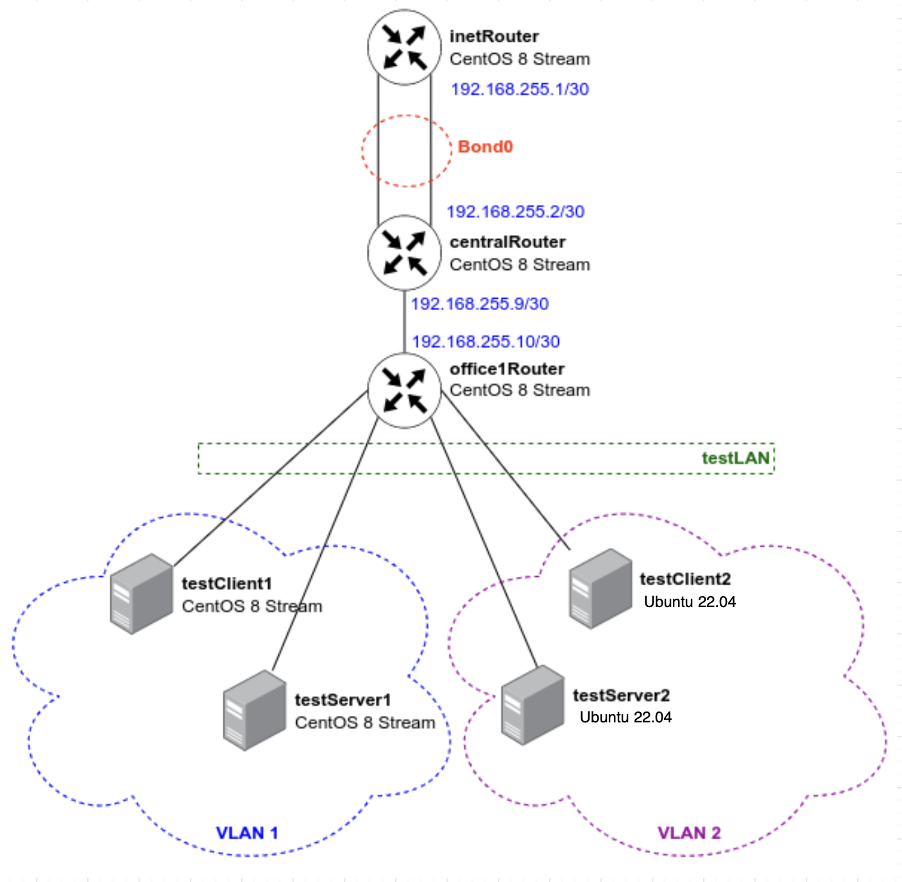

# Методическое пособие по выполнению домашнего задания 
# по курсу «Администратор Linux. Professional»
# Vagrant-стенд c VLAN и LACP

## Цель домашнего задания
Научиться настраивать VLAN и LACP. 

## Формат сдачи ДЗ
vagrant + ansible
### Схема сети

