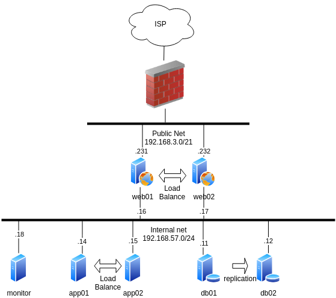

# Проектная работа

**Название:**  
**"Автоматизированное развертывание отказоустойчивого веб-приложения на базе Django с использованием Ansible"**

## Обзор проекта

Проект представляет собой дипломную работу, посвященную разработке и внедрению системы автоматического развертывания отказоустойчивого веб-приложения на базе фреймворка Django. Основное внимание уделяется использованию Ansible для автоматизации развертывания и управления инфраструктурой.

## Архитектура и компоненты
### Визуальная схема

### 1. Клиенты (Пользователи)

- Пользователи взаимодействуют с веб-приложением через интернет.

### 2. Балансировщики нагрузки (Angie)

- **Публичные IP-адреса:**
  - `192.168.3.231`
  - `192.168.3.232`
- **Приватные IP-адреса:**
  - `192.168.57.16`
  - `192.168.57.17`
- Распределяют запросы от пользователей между серверами приложений для обеспечения высокой доступности.

### 3. Серверы приложений (Django)

- **IP-адреса:**
  - `192.168.57.14`
  - `192.168.57.15`
- На этих серверах развернут Django с Gunicorn, работающий на порту 8000, который обрабатывает запросы от пользователей и взаимодействует с базой данных.

### 4. Серверы баз данных PostgreSQL

- **Мастер-сервер:** `192.168.57.11`
- **Реплика-сервер:** `192.168.57.12`
- PostgreSQL обеспечивает надежное хранение данных с репликацией для повышения отказоустойчивости.

### 5. Сервер мониторинга и логирования

- **Мониторинг:** Prometheus
- **Хранение логов:** Elasticsearch
- **Визуализация:** Grafana
- Собирает и визуализирует данные мониторинга и логи для обеспечения эффективного наблюдения за состоянием приложения.

### 6. Автоматизация развертывания

- **Инструмент:** Ansible
- Ansible используется для автоматизации развертывания, настройки и управления всеми компонентами системы, включая серверы приложений, базы данных и серверы мониторинга.
- Ansible Playbooks обеспечивают автоматическую конфигурацию серверов, установку необходимых пакетов и настройку сетевых соединений, что минимизирует вероятность человеческих ошибок и ускоряет процесс развертывания.

### 7. Безопасность и резервное копирование

- Все серверы защищены брандмауэрами (iptables), разрешающими доступ только по необходимым портам.
- **Резервное копирование:** Barman
  - Используется для регулярного создания резервных копий базы данных и обеспечения возможности восстановления данных в случае сбоя.

## Цели проекта

- **Автоматизация развертывания:** Обеспечить автоматическое развертывание и настройку всех компонентов системы с использованием Ansible.
- **Отказоустойчивость:** Реализовать архитектуру, обеспечивающую высокую доступность и устойчивость приложения к сбоям.
- **Мониторинг и логирование:** Обеспечить сбор и визуализацию данных о работе приложения для оперативного реагирования на потенциальные проблемы.

## Заключение

Проект демонстрирует интеграцию современных технологий автоматизации и отказоустойчивости в разработке веб-приложений. Использование Ansible для автоматизации развертывания позволяет значительно улучшить управление инфраструктурой, сократить время на развертывание и минимизировать ошибки конфигурации. Система обеспечивает надежную работу веб-приложения, устойчивость к сбоям и эффективный мониторинг его состояния.
