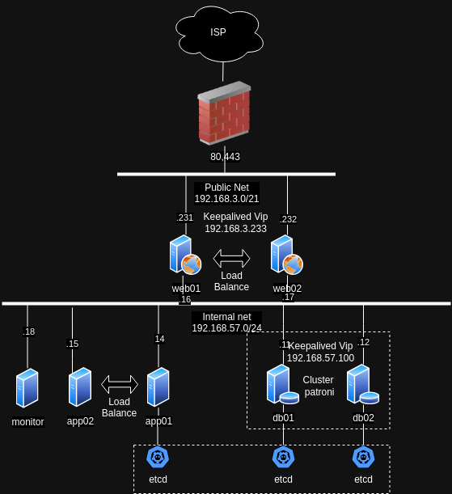

# Описание проекта: Веб-приложение на Django

## Общий обзор

Проект представляет собой веб-приложение, разработанное с использованием фреймворка Django. Приложение развернуто в высоконадежной и масштабируемой инфраструктуре, состоящей из нескольких серверов. Основные компоненты системы включают серверы приложений, базы данных, балансировщики нагрузки, а также серверы мониторинга и логирования. Все серверы работают в защищенной приватной сети с ограниченным доступом из публичной сети, обеспечивая безопасность и надежность работы.

## Архитектура системы

## Визуальная схема

### 1. Серверы приложений

Два сервера приложения (Django), работающие в приватной сети, обеспечивают выполнение основного функционала веб-приложения. На каждом из серверов развернут Gunicorn, который слушает порт 8000 и обрабатывает HTTP-запросы.

- **IP-адреса серверов приложений:**  
  - Сервер 1: `192.168.57.14`
  - Сервер 2: `192.168.57.15`

Эти серверы взаимодействуют с серверами баз данных через приватную сеть, что обеспечивает безопасность передачи данных.

### 2. Серверы баз данных

Система баз данных представлена двумя серверами, настроенными для репликации данных. Главный сервер (мастер) обрабатывает все записи, в то время как реплика (слейв) обеспечивает резервное хранение и чтение данных.

- **IP-адреса серверов баз данных:**
  - Мастер-сервер: `192.168.57.11`
  - Реплика-сервер: `192.168.57.12`

### 3. Балансировщики нагрузки

Для распределения нагрузки и обеспечения доступности веб-приложения используются два сервера балансировки нагрузки на базе Angie. Эти серверы имеют интерфейсы как в приватной, так и в публичной сети.

- **IP-адреса в публичной сети:**
  - Балансировщик 1: `192.168.3.231`
  - Балансировщик 2: `192.168.3.232`

- **IP-адреса в приватной сети:**
  - Балансировщик 1: `192.168.57.16`
  - Балансировщик 2: `192.168.57.17`

Публичный доступ разрешен только к серверам балансировки через порты 80 (HTTP) и 443 (HTTPS).

### 4. Сервер мониторинга и логирования

Мониторинг инфраструктуры осуществляется с помощью Prometheus, который также собирает логи в Elasticsearch. Grafana используется в качестве интерфейса для визуализации данных мониторинга и логов.

### 5. Безопасность и резервное копирование

На всех серверах настроены брандмауэры (iptables), которые разрешают доступ по SSH и необходимым портам в приватной сети, ограничивая публичный доступ к серверам балансировки. 

Резервное копирование данных баз данных настроено с использованием Barman, что обеспечивает защиту данных и возможность восстановления в случае аварий.

## Заключение

Данная архитектура обеспечивает надежную, безопасную и масштабируемую работу веб-приложения. Использование приватной сети и балансировщиков нагрузки обеспечивает высокую степень защиты данных и высокую доступность сервиса для пользователей. Система мониторинга и логирования позволяет своевременно обнаруживать и устранять возможные проблемы в работе приложения.
{
    "prompt": "A network diagram of a Django web application architecture. Include the following components: 1. Clients: Users connecting via the internet to load balancers. 2. Load Balancers (Angie): Two servers with public IPs 192.168.3.231 and 192.168.3.232, and private IPs 192.168.57.16 and 192.168.57.17. 3. Application Servers (Django): Two servers with IPs 192.168.57.14 and 192.168.57.15, processing user requests and interacting with the database. 4. Database Servers: Master server with IP 192.168.57.11 and replica server with IP 192.168.57.12 for data storage and replication. 5. Monitoring and Logging Server: Uses Prometheus and Elasticsearch with Grafana for data visualization. 6. Security: All servers protected by firewalls, with public access allowed only on ports 80 and 443 on the load balancers. Use clear labels and connections between components to show the flow of data and requests.",
    "size": "1792x1024"
}
